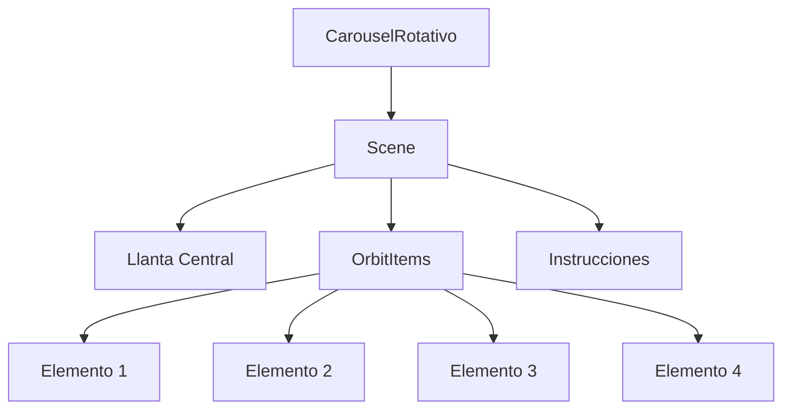

# 🌄 Carrusel Rotativo Interactivo

[Carrusel Preview](https://mariaconejo.github.io/Carrusel-llanta/)


Un carrusel circular interactivo que muestra destinos naturales con animaciones fluidas, navegación accesible y diseño responsivo.

## ✨ Características Principales

- **Rotación 360° interactiva** mediante arrastre con el mouse/touch
- **Animaciones fluidas** con Framer Motion
- **Diseño orbital** con efecto de profundidad 3D
- **Accesibilidad completa** (navegación por teclado + lectores de pantalla)
- **Rotación automática** cuando no está en uso
- **Optimización de imágenes** con Cloudinary CDN
- **Diseño responsive** para diferentes tamaños de pantalla

## 🛠 Tecnologías Utilizadas

| Tecnología | Uso |
|------------|-----|
|  | Biblioteca principal para UI components |
|  | Tipado estático para mayor seguridad |
|  | Animaciones fluidas y gestos |
|  | Estilización de componentes |
|  | Almacenamiento y entrega de imágenes |

## 🚀 Implementación Técnica

### Estructura del Componente



### Lógica Clave

1. **Sistema de Coordenadas Polares**:
```typescript
const x = ORBIT_RADIUS * Math.cos(rad);
const y = ORBIT_RADIUS * Math.sin(rad) * 0.8;
```

2. **Cálculo de Posición y Escala**:
```typescript
const scale = 0.7 + (1 - dist / 180) * 0.5;
const opacity = 0.5 + (1 - dist / 180) * 0.5;
```

3. **Mecanismo de Arrastre**:
```typescript
const diff = currentAngle - dragStartAngle.current;
angle.set(dragStartRotation.current + diff * reductionFactor);
```

4. **Snapping Automático**:
```typescript
const snapped = Math.round(raw / degreesPerItem) * degreesPerItem;
animate(angle, snapped, { duration: 0.4 });
```

## ♿ Accesibilidad

### Características Implementadas

1. **Navegación por Teclado**:
   - ← → : Rotación del carrusel
   - Enter/Espacio: Selección de elemento actual

2. **Semántica ARIA**:
   ```jsx
   <Scene role="region" aria-label="Carrusel de destinos naturales">
     <OrbitItem 
       role="button"
       aria-label={`Ver detalles de ${title}`}
       aria-describedby={`desc-${id}`}
     >
   ```

3. **Anuncios para Lectores de Pantalla**:
   ```jsx
   <SrOnly aria-live="polite" aria-atomic="true">
     {`Destino actual: ${currentItem.title}`}
   </SrOnly>
   ```

4. **Enfoque Visible**:
   ```css
   *:focus-visible {
     outline: 3px solid #4a90e2;
     border-radius: 4px;
   }
   ```

5. **Elementos Ocultos para Solo Lectores**:
   ```jsx
   const SrOnly = styled.span` /* ... estilos de ocultamiento */ `;
   ```

## ☁️ Integración con Cloudinary

Todas las imágenes se sirven a través de Cloudinary para optimización automática:

```typescript
const items = [
  {
    image: 'https://res.cloudinary.com/dmgz3csfp/...',
    // ...
  }
];
```

**Beneficios:**
- Transformaciones en tiempo real (`/upload/c_scale,w_500/`)
- Formato moderno automático (WebP/AVIF)
- Compresión inteligente
- Entrega a través de CDN global
- Reducción de peso de imágenes hasta 70%

## 🚀 Instalación y Uso

1. Clonar repositorio:
```bash
git clone https://github.com/mariaconejo/Carrusel-llanta.git
```

2. Instalar dependencias:
```bash
npm install
```

3. Iniciar aplicación:
```bash
npm run dev
```


## 📊 Optimizaciones Clave

| Área | Técnica |
|------|---------|
| Rendimiento | `useTransform` para cálculos eficientes |
| Animaciones | `requestAnimationFrame` integrado |
| UX | Transiciones cubic-bezier personalizadas |
| Accesibilidad | Soporte completo de navegación por teclado |
| Imágenes | Compresión y formato moderno con Cloudinary |

